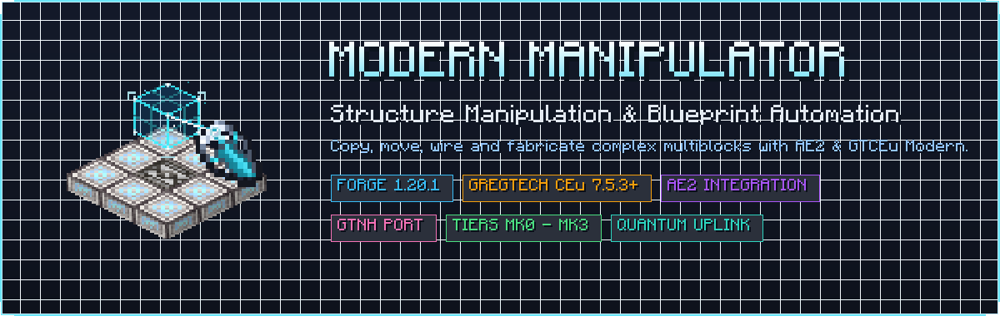

<div align="center">
  
  <br><br>
  <h1>ModernManipulator</h1>
  <p><strong>Next-generation handheld building, structure duplication, and automated fabrication for GregTech CEu Modern</strong></p>

  <p>
    <a href="https://github.com/Raishxn/ModernManipulator/releases"></a>
    
    
    <a href="https://www.curseforge.com/minecraft/mc-mods/gregtechceu-modern"></a>
    <a href="https://www.curseforge.com/minecraft/mc-mods/applied-energistics-2"></a>
    <a href="LICENSE.MD"></a>
  
  </p>
</div>

---

**ModernManipulator** is a dedicated Forge 1.20.1 port and modern remaster of **[MatterManipulator](https://github.com/GTNewHorizons/MatterManipulator)** from *GregTech: New Horizons*, engineered from the ground up for **GregTech CEu Modern 7.5.3+** and **Applied Energistics 2**.

One handheld matter manipulation tool to build, copy, move, exchange, and wire whole structures, high-tier factories, and complex multiblock lines—pulling items and fluids seamlessly from your inventory, your AE2 ME network, or the interdimensional **Quantum Uplink**.

---

## Table of Contents

- [Why ModernManipulator?](#why-modernmanipulator)
- [Key Features](#key-features)
  - [Manipulator Tiers](#manipulator-tiers)
  - [Operating Modes](#operating-modes)
  - [GregTech CEu Modern Integration](#gregtech-ceu-modern-integration)
  - [Applied Energistics 2 Integration & Smart Copy](#applied-energistics-2-integration--smart-copy)
  - [The Quantum Uplink Multiblock](#the-quantum-uplink-multiblock)
  - [Manipulator Upgrades](#manipulator-upgrades)
- [Controls & Quick Start Guide](#controls--quick-start-guide)
  - [Radial Menu Navigation](#radial-menu-navigation)
  - [Copying & Pasting Multiblocks](#copying--pasting-multiblocks)
  - [Moving Functional Machinery](#moving-functional-machinery)
  - [Block & Cable Replacement](#block--cable-replacement)
  - [Automated Crafting with Plans](#automated-crafting-with-plans)
- [Item & Power Sourcing Hierarchy](#item--power-sourcing-hierarchy)
- [Installation & Requirements](#installation--requirements)
- [Building from Source](#building-from-source)
- [Credits & Attribution](#credits--attribution)
- [License](#license)

---

## Why ModernManipulator?

- ⚡ **Instant Multiblock Cloning**: Duplicate massive GregTech multiblocks, cleanrooms, and chemical lines in seconds—no manual placing of hundreds of casings, buses, and hatches.
- 🔍 **Pixel-Perfect Ghost Previews**: Real-time holographic bounding boxes (`mm_fancybox`), ghost block projections (`mm_ghost`), rulers, and color-coded placement validation before placing a single block.
- 🧩 **Preserves 100% GregTech State**: Faithfully transfers covers, screwdriver configurations, paint colors, machine facings, muffled states, circuits, turbine rotors, and auto-output settings.
- 🌐 **Infinite Range & Interdimensional ME Sync**: Connect directly to your Applied Energistics 2 storage network anywhere across any dimension via the Quantum Uplink multiblock or Wireless Access Points.
- 🤖 **Automated Fabrication Plans**: Missing materials? Generate an AE2 crafting plan with one click, automatically commanding AE2 crafting CPUs to fabricate every missing component.

---

## Key Features

### Manipulator Tiers

The Matter Manipulator scales across 4 tech tiers, matching the progression and capabilities of GregTech: New Horizons:

| Tier | Voltage Tier | Range (Radius) | Placement Speed | Internal EU Buffer | Compatible Upgrades |
| :--- | :--- | :---: | :---: | :---: | :--- |
| **Prototype** | MV (128V) | 16 blocks | 1 block / tick | 100,000 EU | Excavation |
| **MK I** | HV (512V) | 32 blocks | 2 blocks / tick | 1,000,000 EU | Aux Teleporter, Wiring Harness |
| **MK II** | EV (2048V) | 64 blocks | 4 blocks / tick | 10,000,000 EU | Aux Teleporter, Wiring Harness |
| **MK III** | LuV / ZPM / UV | 128 blocks | 8 blocks / tick *(configurable)* | 100,000,000 EU | Aux Teleporter, Wiring Harness, Energy Tunnel |

---

### Operating Modes

Select your active mode via the in-game radial menu (`Right-Click Air`):

- 📐 **Geometry Mode**:
  - Procedurally generate geometric shapes: **Line**, **Cube**, **Sphere**, and **Cylinder**.
  - Assign distinct weighted block lists for **Corners**, **Edges**, **Faces**, and internal **Volume**.
- 📋 **Copying Mode**:
  - Select two corners of any structure and stamp duplicates anywhere in the world.
  - Full 3D transformation: rotate in 90° increments, flip across X or Z axes, and repeat in linear arrays/stacks.
- 🚚 **Moving Mode**:
  - Relocate fully functional machines and multiblocks without breaking them or dropping loose items.
- 🔄 **Exchanging Mode**:
  - Replace blocks in-place using configurable whitelist filters (e.g. swap all stone bricks for high-tier machine casings).
- 🔌 **Cables Mode**:
  - Rapidly lay down and replace GregTech power cables, fluid pipes, and AE2 glass/dense cables across long runs.

---

### GregTech CEu Modern Integration

ModernManipulator includes first-class support for the deep block entity state of GregTech CEu Modern:

- 🛡️ **Covers & Configurations**: Automatically copies robot arms, conveyors, pumps, and fluid regulators along with their transfer conditions, filter slots, and internal settings.
- ⚙️ **Machine State & Rotations**: Replicates horizontal facings, upwards facings, secondary rotations, muffled sounds, and circuit configurations.
- 🎨 **Painting & Aesthetics**: Preserves custom block paint dyes and machine colors.
- 🔄 **Auto-Output & Connections**: Copies fluid/item auto-output toggle states, pipe/cable connections, and blocked faces.
- 🌪️ **Large Turbine Rotors**: Safely preserves and transfers high-tier turbine rotor items inside multiblock turbines.
- 🔋 **Battery Buffers & Inventories**: Accurately handles battery inventories and container contents.

---

### Applied Energistics 2 Integration & Smart Copy

ModernManipulator integrates deeply with Applied Energistics 2 (when installed):

- 🌐 **Wireless Access Point Linking**: Place an MKI+ Matter Manipulator into the link slot of an AE2 Wireless Access Point to pull materials directly from that ME system within wireless range.
- 🔀 **Cable Bus Parts & Facades**: Full support for copying cable bus attachments (import/export buses, storage buses, level emitters), memory card configurations, and cable facades.
- 🧠 **Smart Copy (Pattern Buffers to Proxies)**: When copying automation setups, Smart Copy intelligently maps pattern buffers to pattern buffer proxies, preventing configuration collisions.

---

### The Quantum Uplink Multiblock

The **Quantum Uplink** is a massive 9×9×9 multiblock structure engineered for end-game interdimensional automation:

- 🌌 **Infinite Range ME Access**: Link your Matter Manipulator to the controller with a single right-click for unlimited interdimensional reach.
- ⚡ **Power & Plasma Costs**: Consumes 1A ZPM while active and a small amount of plasma per transfer (from connected input hatches).
- 📜 **Automated Crafting with Plans**:
  - Open **Planning** in the radial menu to generate a complete bill of materials for your selection.
  - Automatically pushes fake processing patterns into connected ME systems and triggers auto-crafting requests for all missing blocks.
- 🔋 **Energy Tunnel Power Provider**: Works with the Energy Tunnel upgrade to provide infinite wireless energy refills to MKIII manipulators.

---

### Manipulator Upgrades

Customize your tool with modular upgrades installed via crafting:

| Upgrade | Applicable Tiers | Function |
| :--- | :--- | :--- |
| **Excavation Upgrade** | Prototype | Unlocks block-clearing and removal capabilities for the Prototype tier. |
| **Auxiliary Teleporter Upgrade** | MK I, MK II, MK III | Doubles the block placement rate per tick for rapid construction. |
| **Adaptive Wiring Harness Upgrade** | MK I, MK II, MK III | Reduces manipulator EU power consumption by 50%. |
| **Energy Tunnel Upgrade** | MK III | Draws wireless EU power directly from laser or multi-amp hatches on linked Quantum Uplinks. |

---

## Controls & Quick Start Guide

### Radial Menu Navigation

- **Right-Click Air**: Opens the interactive radial menu tree.
- Navigate modes, select geometry shapes, adjust removal modes (**None**, **Replaceable**, **All**), configure block whitelists, and access the transform editor.

### Copying & Pasting Multiblocks

1. Hold your Matter Manipulator and open the radial menu (`Right-Click Air`). Select **Copying**.
2. Press **C** (*Mark Copy*) and right-click two opposite corners of the structure you want to duplicate.
3. Press **V** (*Mark Paste*) and right-click the target origin where the structure should be placed.
4. Preview the holographic ghost blocks (`mm_ghost`). Use the **Transform Editor** in the radial menu if you need to rotate, flip, or stack the build.
5. Right-click with the manipulator to build!

### Moving Functional Machinery

1. Open the radial menu and select **Moving**.
2. Press **X** (*Mark Cut*) and select the corners of the machine/assembly to relocate.
3. Press **V** (*Mark Paste*) at the new destination.
4. Right-click to safely teleport the machinery in-place.

### Block & Cable Replacement

1. Select **Exchanging** in the radial menu.
2. Middle-click any block in your world (or inside a GUI slot) to set it as the replacement block.
3. Configure the replace whitelist in the radial menu to specify which blocks should be swapped.
4. Click and drag across the target area to exchange blocks instantly.

### Automated Crafting with Plans

1. Bind a **Matter Manipulator MKIII** to a **Quantum Uplink** by right-clicking the uplink controller.
2. Select an area in **Copying** mode.
3. Open **Planning** in the radial menu and click **Plan (Missing, Auto)**.
4. The Quantum Uplink communicates with your AE2 system, calculates missing blocks, and schedules crafting orders across your AE2 crafting CPUs.
5. Once crafting completes, place the structure effortlessly!

---

## Item & Power Sourcing Hierarchy

When placing structures, ModernManipulator retrieves materials and power using a strict fallback hierarchy:

### Item Sourcing Order
1. **Pending Drops**: Re-uses blocks broken during the current placement operation.
2. **Player Inventory**: Draws matching items and fluid containers directly from your hotbar and inventory.
3. **ME Wireless System**: Pulls from linked AE2 networks via Wireless Access Points.
4. **Quantum Uplink**: Extracts items and fluids with infinite range from the linked ME network.

### Item Recovery Order (When Clearing/Cutting)
`ME Network` ➔ `Quantum Uplink` ➔ `Player Inventory` ➔ `World Drops`

### Power Cost Formula
$$\text{EU Cost} = (\text{Hardness} + \text{Block Entity Penalty}) \times \text{Distance}^{1.25}$$

*(Installing the Adaptive Wiring Harness upgrade reduces total EU costs by 50%.)*

---

## Installation & Requirements

| Component | Required Version | Note |
| :--- | :--- | :--- |
| **Minecraft** | `1.20.1` | Required |
| **Forge** | `47.4.0` or newer | Required |
| **[GregTech CEu Modern](https://www.curseforge.com/minecraft/mc-mods/gregtechceu-modern)** | `7.5.3` or newer | **Required** |
| **[Applied Energistics 2](https://www.curseforge.com/minecraft/mc-mods/applied-energistics-2)** | `15.0.0` or newer | Recommended *(enables ME features & Quantum Uplink)* |

---

## Building from Source

Requirements: **JDK 17** or newer.

```sh
# Clone the repository
git clone https://github.com/Raishxn/ModernManipulator.git

# Build the mod jar
./gradlew build
```

Compiled jar files are generated in `build/libs/`.

---

## Credits & Attribution

ModernManipulator is built upon the ingenuity of the GregTech community:

- **[GTNewHorizons/MatterManipulator](https://github.com/GTNewHorizons/MatterManipulator)** (LGPL-3.0): The original 1.7.10 mod created by **RecursivePineapple** and the **GregTech: New Horizons** team. ModernManipulator ports its mechanics, radial GUI, algorithms, upgrades, and Quantum Uplink multiblock.
- **[GregTech CEu Modern](https://github.com/GregTechCEu/GregTech-Modern)**: For the modern GregTech API, block entity structures, and multiblock framework.
- **[Applied Energistics 2](https://github.com/AppliedEnergistics/Applied-Energistics-2)**: For modern ME storage and crafting integration.
- The **Minecraft Forge** team and the **GTNH** community.

---

## License

ModernManipulator is licensed under the **GNU Lesser General Public License v3.0** (LGPL-3.0), matching the license of the original MatterManipulator. See [LICENSE.MD](LICENSE.MD).
